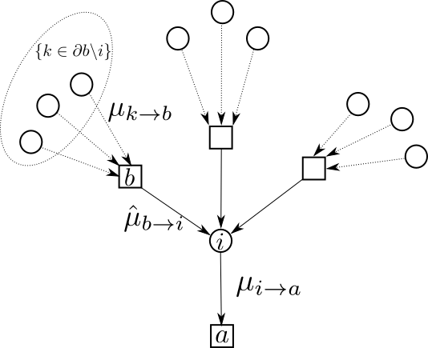

## Réseau sous contraintes

### Sujet
Imaginez que vous êtes à la tête d'une entreprise de livraison qui livre des matières premières pour des chantiers. Chaque jour, vous avez N livreurs et N chantiers. Pour optimiser les coûts de livraisons, vous mettez en relation chaque chantier avec k livreurs tirés au hasard. Quel type de marchandise chaque livreur doit prendre dans sa journée pour éviter que tous les livreurs d'un même chantier livre la même marchandise ? En désignant les marchandises par des couleurs, ce problème revient à résoudre le problème de coloriage sur hypergraphes. C'est un problème NP-complet, lorsque le nombre M/N est grand, il devient très dur à résoudre. Vous concevrez un programme en C qui génère des instances aléatoires de ce problème et trouve une solution à l'aide de la méthode de recuit simulé. Vous évaluerez dans un second temps la limite M/N au delà de laquelle votre algorithme échoue.
 

### Démarche proposée
1. Créer des instances pour le problème NAE-3-SAT en utilisant la notion de graphes bipartites aléatoires.
2. Ecrire un programme qui vérifie si une problème est satisfait ou non.
3. Implémenter une méthode de résolution de votre choix (Simulated Annealing, Belief Propagation, Genetic Algorithm).
4. Implémenter une méthode de recherche de solution à partir des résultats de la méthode précédente.
5. Comparer les performances de votre programme à d'autres méthodes ou à une approche brute-force.
6. Mettre en évidence la non satisfabilité pour les grandes valeurs de M/N.

### Définition d'un Problème NAESAT :
Mathématiquement, le problème NAESAT (Not-All-Equal Satisfiability) consiste à déterminer si une conjonction de clauses logiques peut être rendue vraie en attribuant des valeurs de vérité aux variables, tout en respectant les contraintes suivantes : chaque clause doit avoir au moins un littéral vrai(1) et au moins un littéral faux(0). Les clauses décrivent des relations entre les variables, et l'objectif est de trouver une assignation des variables qui satisfait ces contraintes.

Le problème NAESAT peut être assimilé au problème de coloriage de graphes à deux couleurs.

### Lien avec l'analogie des rôles dans un réseau
Les membres d'un réseau (ex: les livreurs) sont représentés par des variables qui peuvent avoir deux états (ex : marchandise type "sable" :1; marchandise type "ciment" :0). Chaque chantier est représentée par une clause dans laquel les livreurs sont connectés et pour lequel la contrainte impose d'avoir au moins un livreur apportant une marchandise de chaque type.

### Lien avec les Graphes Bipartites
Le problème NAESAT peut être visualisé sous forme de graphes bipartites, où les nœuds d'un ensemble représentent les variables et les nœuds de l'autre ensemble représentent les clauses. Les arêtes du graphe indiquent les liens entre les variables et les clauses. Cette représentation graphique facilite la visualisation et l'analyse du problème, tout en permettant l'application d'algorithmes de propagation de messages.

*Figure 1 : Graphe bipartite. Les clauses sont représentées par des carrés et les variables par des cercles. Les liens définissent les variables entrantes dans chacune des clauses.*

### Méthode de Propagation de Message dans les graphes bipartites
L'algorithme de propagation de message (Belief Propagation) repose sur la mise à jour itérative des messages échangés entre les nœuds du graphe. Ces messages reflètent les croyances et les probabilités concernant les attributions de variables. Les équations utilisées dans la propagation de message permettent d'ajuster ces probabilités en fonction des informations des nœuds voisins, aboutissant à une convergence vers une solution potentielle du problème.

Cette approche de propagation de message permet une exploration systématique de l'espace des solutions et offre un cadre méthodologique pour résoudre des instances du problème NAESAT.

*Figure 2 : Illustration du calcul des messages dans la méthode de propagation de croyances.*

### Calcul des messages
-  partant des variables :
$$\mu_{i \to a}(x_i) = \prod_{b \in \partial i \backslash a}\hat{\mu}_{b \to i}(x_i)$$
- arrivant sur les variables :
$$\hat{\mu}_{b \to i}(x_i) = \sum_{\mathbf{x}_{\partial b \backslash i}} f_b(x_i,\mathbf{x}_{\partial b \backslash i}) \prod_{k \in \partial b \backslash i} \mu_{k \to b}(\mathbf{x}_k)$$

### Calculs des croyances

$$p(x_i) \propto \prod_{b \in \partial i} \hat{\mu}_{b \to i}(x_i)$$

où 
- $i$, $a$, $b$ : Variables et clauses dans le graphe factoriel.
- $\mu_{i \to a}(x_i)$ : Message de la variable $i$ à la clause $a$, indiquant la croyance que $x_i$ prend la valeur $x_i$.
- $\hat{\mu}_{b \to i}(x_i)$ : Message de la clause $b$ à la variable $i$, indiquant la croyance que $b$ est satisfait si $x_i$ prend la valeur $x_i$.
- $\partial i$ : Ensemble des voisins de la variable $i$.
- $\mathbf{x}_{\partial b \backslash i}$ : Toutes les valeurs des variables voisines de $b$, sauf $i$.
- $f_b(x_i,\mathbf{x}_{\partial b \backslash i})$ : Fonction de coût associée à la clause $b$, dépendant des valeurs de $x_i$ et des autres variables.
- $\mu_{k \to b}(\mathbf{x}_k)$ : Message reçu par $b$ de la part de son voisin $k$.
- $p(x_i)$ : Croyance locale de la variable $i$, indiquant la probabilité que $x_i$ prenne la valeur $x_i$.

Dans le contexte du problème NAESAT (Not-All-Equal SAT), la fonction de coût associée à une clause $b$ dépend des valeurs booléennes des variables présentes dans cette clause. L'objectif est de s'assurer qu'au moins une des variables est vraie (satisfait) et qu'au moins un des variables est faux (non satisfait). Par conséquent, la fonction de coût $f_b$ peut être définie de la manière suivante :

$$
f_b(x_{l_1}, x_{l_2}, \ldots, x_{l_k}) = \begin{cases} 
      1 & \text{si au moins un variable est vraie et au moins une variable est fausse} \\
      0 & \text{sinon}
\end{cases}
$$

Où $x_{l_1}, x_{l_2}, \ldots, x_{l_k}$ sont les valeurs de vérité des variables présents dans la clause $b$. Si au moins une des variables est vraie et au moins une des variables est fausse, alors la clause $b$ est satisfaite (coût 1), sinon, le coût est fixé à 0 pour indiquer que la clause n'est pas satisfaite.

Cela permet de représenter les contraintes spécifiques au problème NAESAT, où chaque clause doit avoir à la fois une variable vraie et un variable fausse pour être considérée comme satisfaite.

### Références

1) Kose, A.; Sonmez, B. A.; Balaban, M. Simulated Annealing Algorithm for Graph Coloring. arXiv December 3, 2017. https://doi.org/10.48550/arXiv.1712.00709.

2) Castellani, T.; Napolano, V.; Ricci-Tersenghi, F.; Zecchina, R. Bicolouring Random Hypergraphs. J. Phys. A: Math. Gen. 2003, 36 (43), 11037. [https://doi.org/10.1088/0305-4470/36/43/026](https://doi.org/10.1088/0305-4470/36/43/026).

3) Krz̧akała, F.; Montanari, A.; Ricci-Tersenghi, F.; Semerjian, G.; Zdeborová, L. Gibbs States and the Set of Solutions of Random Constraint Satisfaction Problems. Proceedings of the National Academy of Sciences 2007, 104 (25), 10318–10323. [https://doi.org/10.1073/pnas.0703685104](https://doi.org/10.1073/pnas.0703685104).

4) Mézard, M.; Parisi, G.; Zecchina, R. Analytic and Algorithmic Solution of Random Satisfiability Problems. Science 2002, 297 (5582), 812–815. [https://doi.org/10.1126/science.1073287](https://doi.org/10.1126/science.1073287).

[Haut de la page](#allocation-de-rôles-dans-un-réseau)

[Retour page](sujets_AH.md#projets-informatiques-chimie-paris-proposé-par-arthur-hardiagon)