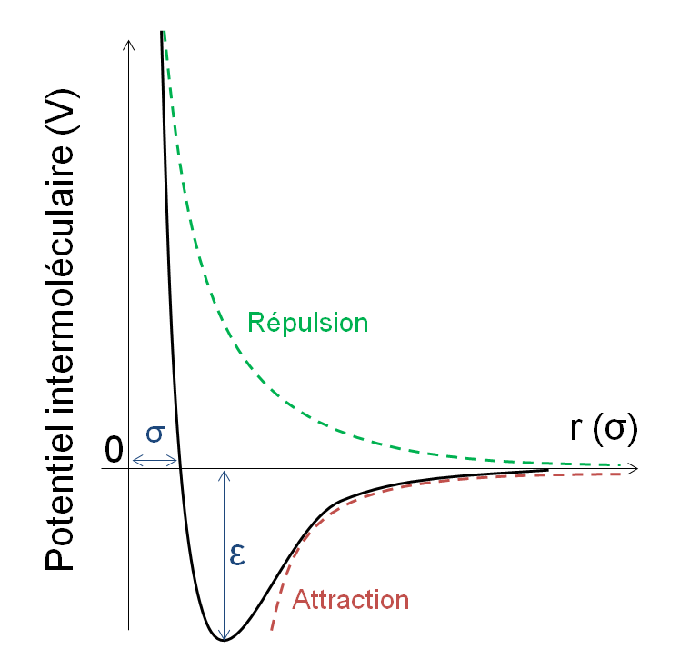
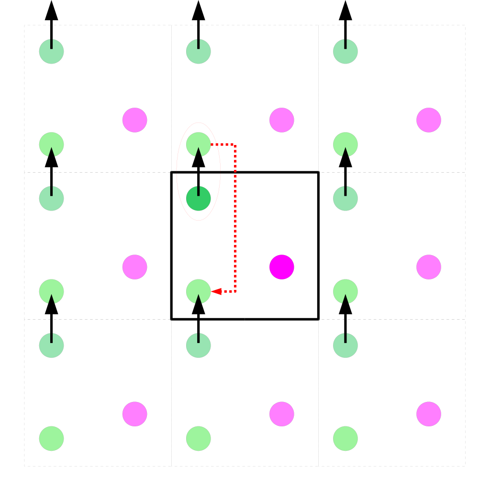

## Simulation d'un gaz rare
<!--
Pour comprendre les phénomènes physiques à l'échelle moléculaire, on peut avoir recours aux simulations. Dans ce projet, vous allez construire votre propre programme de simulation pour étudier le comportement d'un liquide de sphères de Lennard-Jones, un modèle couramment utilisé pour les atomes non polaires, comme l'argon liquide. La méthode utilisée sera la méthode de Monte-Carlo pour un système où le nombre de particules, le volume et la température de la simulation sont fixés. Vous vérifierez la convergence du système vers un état d'équilibre, ainsi que la précision de votre modèle en comparant quelques points de l'équation d'état obtenus dans les simulations avec des données expérimentales.
-->
### Démarche proposée

1. Étudier le modèle de sphères de Lennard-Jones et son utilisation pour modéliser les interactions entre particules non polaires.

2. Définir les paramètres de la simulation (nombre de particules, volume du conteneur, température, ...) et générer les positions initiales des particules dans le conteneur.
3. Tenir compte de conditions périodiques
4. Implémenter le déplacement des atomes dans la boîte en utilisant la méthode de Monte Carlo et l'algorithme de Metropolis
5. Surveiller les propriétés du système pour observer la convergence vers un état d'équilibre.
7. Calculer l'équation d'état du système ($\beta P$ en fonction de $\rho$)) à partir des propriétés mesurées et les comparer à des valeurs expérimentales.

### Potentiel d'interaction
Potentiel de Lennard-Jones :
$$
U({r}_{ij}) = 4 \epsilon [(\frac{\sigma}{r_{ij}})^{12}-(\frac{\sigma}{r_{ij}})^{6})
$$




*Figure 1 : Potentiel d'interaction entre sphères de Lennard-Jones.</a>*

Pour simplifier le problème, on pourra tronquer les interactions entre particules à partir d'une certaine distance.

### Conditions périodiques

Les conditions périodiques, également connues sous le nom de conditions aux limites périodiques, jouent un rôle essentiel en simulation, en particulier dans le domaine de la modélisation moléculaire et des simulations numériques en sciences physiques. Leur principal intérêt réside dans la capacité à simuler des systèmes à grande échelle de manière efficace tout en minimisant les biais liés aux limites du système. En imposant des conditions périodiques, on crée un univers virtuel où les particules se comportent comme si elles étaient entourées par une infinité de copies d'elles-mêmes, ce qui permet de préserver la continuité des interactions à travers les frontières du système. Ainsi, les simulations peuvent étudier des phénomènes macroscopiques, tels que les propriétés thermodynamiques, la diffusion, ou la dynamique des fluides, avec une grande précision et sans subir l'influence des bords du système. Les conditions périodiques sont donc une technique puissante qui facilite l'exploration de comportements collectifs et la compréhension des systèmes complexes à l'échelle atomique ou moléculaire, tout en économisant des ressources de calcul considérables.



*Figure 2 : Illustration des conditions périodiques dans un espace 2D lors du mouvement d'une particule au bord de la boîte.</a>*

### Algorithme de Monte Carlo

Dans une simulation de Monte-Carlo, les particules sont déplacés en faisant des sauts aléatoires. Le déplacement des particules ne reproduit pas le déplacement réel des particules, comme dans une simulation de Dynamique Moléculaire. Cependant, si l'on choisi bien le critère de déplacement des particules, l'échantillonnage des positions du système reflète bien l'équilibre thermodynamique et cela est généralement moins coûteux en temps de calcul qu'une simulation de Dynamique Moléculaire. De plus, la règle d'acceptance est un procédé probabiliste dont la température est un paramètre, ce qui nous permet d'étudier le systèmes à température $T$ fixé. Pour que la probabilité du système de visiter un point particulier $\vec{r}^N$ suive la loi de Boltzmann $P(\vec{r}^N) \propto e^{\frac{-E(\vec{r}^N)}{k_{B}T}}$, on accepte les mouvements de particule à un taux d'acceptance qui dépend du facteur de Boltzmann. Voici le schéma de l'algorithme :

```
Pour chaque cycle de l'algorithme:
    Sélectionner une particule au hasard parmi N.
    Déplacer la particule selon une distribution gaussienne.
    Calculez la variation d'énergie delta_E.
    Acceptez le déplacement si delta_E < 0 ou selon une probabilité d'acceptation exp(-delta_E/kT).
```

### Calcul de la pression
Pour un système de particules interagissant par paires, on peut obtenir la pression du système par le développement du Viriel :
$$
P = \rho k_{B}T - \frac{1}{3V} \langle \sum_{i<j} \vec{\nabla} U(r_{ij}).\vec{r_{ij}} \rangle 
$$

avec $\langle \rangle$ une moyenne entre plusieurs configurations, U le potentiel d'interaction de paires et $\rho$ la densité du système, et $\vec{r}_{ij}$ le vecteur reliant deux particules.


### Liens utiles

- [Chapitre de livre](https://dasher.wustl.edu/chem430/readings/frenkel-montecarlo.pdf) *Molecular Simulations* de Frenkel et Smit : pseudocodes pour implémenter un algorithme de simulation moléculaire

[Haut de la page](#simulation-dun-gaz-rare)

[Retour page](sujets_AH.md#projets-informatiques-chimie-paris-proposé-par-arthur-hardiagon)