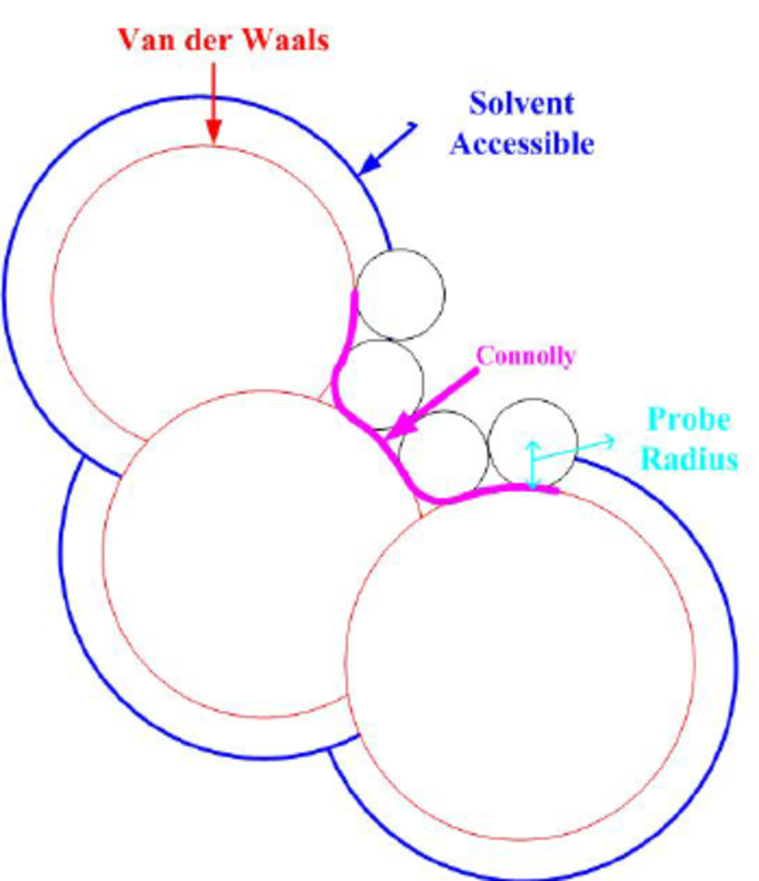

### Surface d'une molécule
<!--
#### Sujet
L'examen approfondi de la surface des molécules biologiques, en particulier des protéines, revêt une importance capitale pour élucider leur structure, ce processus ayant des répercussions significatives sur des aspects essentiels tels que leurs fonctions, leur stabilité et leur réactivité. Vous écrirez un programme informatique permettant de calculer la surface moléculaire d'une protéine ou, dans un premier temps d'une petite molécule, à partir de sa structure PDB. Vous pourrez utiliser une méthode de votre choix, analytique ou discrète.
-->
#### Démarche proposée
1. Définir la surface d'une molécule et ce que l'on veut calculer
2. Analyser un fichier PDB.
3. Définir une méthode de calcul.
4. Implémenter un algorithme et le tester sur des molécules de tailles variables.
5. Comparer la méthode à des programmes existants.
6. Évaluer l'efficacité de l'algorithme et identifier les principales contraintes liées au temps de calcul.

#### Surface d'une molécule : définitions



*Figure 1 : Défition des surfaces de molécule : surface de Van der Waals, surface accessible au solvent (SAS) et surface exclue du solvent (SES) ou surface de Connely. Source : <a href="https://doi.org/10.1007/978-3-642-03270-7_8">Sourina2009</a>*


#### Approche basée sur les grilles
Pour calculer des propriétés géométrique comme la surface et le volume, on peut utiliser une méthode basée sur des grilles. On cherche alors à représenter la densité des atomes sur une grille discrète. La taille de la grille définit la résolution du système.

En C, on pourra utiliser, par exemple un tableau tridimensionnel prédéfini au début du programme :

```c
// Taille de la grille en X, Y et Z (ajustez-la en fonction de votre besoin)
#define GRID_SIZE_X 100
#define GRID_SIZE_Y 100
#define GRID_SIZE_Z 100

// Fonction pour initialiser la grille
void initializeGrid(double grid[GRID_SIZE_X][GRID_SIZE_Y][GRID_SIZE_Z]) {
    for (int x = 0; x < GRID_SIZE_X; x++) {
        for (int y = 0; y < GRID_SIZE_Y; y++) {
            for (int z = 0; z < GRID_SIZE_Z; z++) {
                grid[x][y][z] = 0.0; // Initialise toutes les cellules à 0
            }
        }
    }
}
```

> On pourra utiliser une approche où la taille de la grille est fixée par le pas de la grille et les dimensions de la molécule étudiée.

#### Liens utiles
- Article assez complet sur les méthodes de calcul de surface de molécules, très mathématique. https://www.ljll.math.upmc.fr/~quan/documents/Molecular_Surfaces_els.pdf
- Quelques programmes déjà existants :
   - [MSRoll](http://www.csb.yale.edu/userguides/graphics/msp/msu_local.html#MSRoll)
   - [MSMS](https://ccsb.scripps.edu/msms/documentation/)
   - [BIOVIA](https://www.researchgate.net/publication/353035302_Method_for_installing_Biovia_Discovery_Studio_Viewer_2021_in_Linux_Mint_201_or_Ubuntu_2004)
   - [PYMOL](https://www.youtube.com/watch?v=WC-r53vBLvM)

[Haut de la page](#surface-dune-molécule)

[Retour page](sujets_AH.md#projets-informatiques-chimie-paris-proposé-par-arthur-hardiagon)